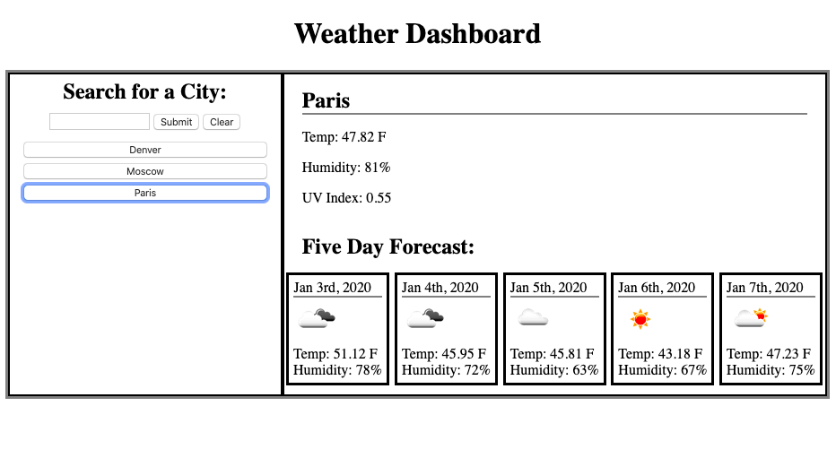

# unit-six-homework

This website allows a user to acces the current weather and 5-day weather projection information for any given location, using the OpenWeather Api.

[Link to site](https://bestbrobradley.github.io/unit-six-homework/)

The primary features include:
-The ability to search for a new location
-The ability to access previous search data
-Search data set to local storage, allowing user to navigate away from page and still retrieve past data
-The ability to clear previous search data

This website uses three different APIs from Open Weather--the basic weather data API, the current UV data API, and the 5-day forecast API.

